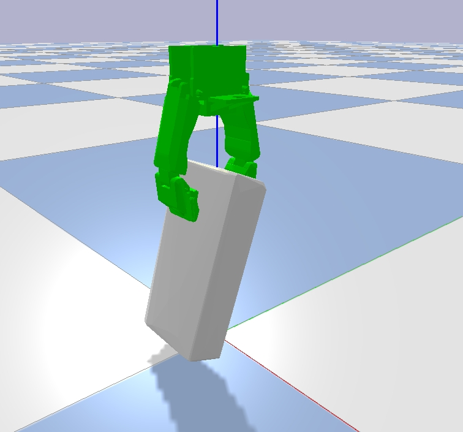

# hsr_hand_simulation

The physical simulation for the hand of HSR Robot (Sasha)
Physics engine: bullet physics (pybullet api)

###  Requirements
1. pybullet (pip install pybullet)
2. numpy
3. opengl
   

### Description of this project
This project will simulate the grasp pose of various objects in a virtual world.




The gipper will be fixed vertically while objects can be placed arbitrary poses. Thus, the relative pose between an object and the hand is measured and saved with grasp annotation (whether it was a successful grap or a failure)

Current implementation:
- test_pybullet.py: simple grasp simulation using the hand of HSR robot
  - Procedure:  
    1) An object is placed in an arbitrary pose using fixed joint constraints with very small force. Therefore, the object can be slightly movable while closing the gripper
    2)  Grasp the object
    3)  Lifting up the gripper, the constraints for the object is no longer valid. Thus, the object will drop to the ground when the grasp pose is bad. 

- Execution:
  - ``$python test_pybullet.py`` 


**Note**:
In generall, the bullet automatically builds the convex hull for the entire object which causes very different behaviors of objects that has concave shapes or holes (e.g., mugs, can). Hence, the model has to be seperated to multiple convex hulls using vhacd tools.  

To do this, you have to compile vhacd in the bullet3 code as follows,
```
git clone https://github.com/bulletphysics/bullet3
cd bullet3/build3
./premake4_osx gmake
cd gmake
make test_vhacd
../../bin/test_vhacd_gmake_x64_release --input [model.obj] --output [output.obj]
```

Further plans:
- Optimization of parameters: very challenging... stay at the local optimum.
- Spwan multiple grippers and objects to simulate multiple grasp poses simultaneously.
- Annotate grasp poses
- Integrate with a pose estimator (Pix2Pose) to grasp an object based on successful grasp poses. 